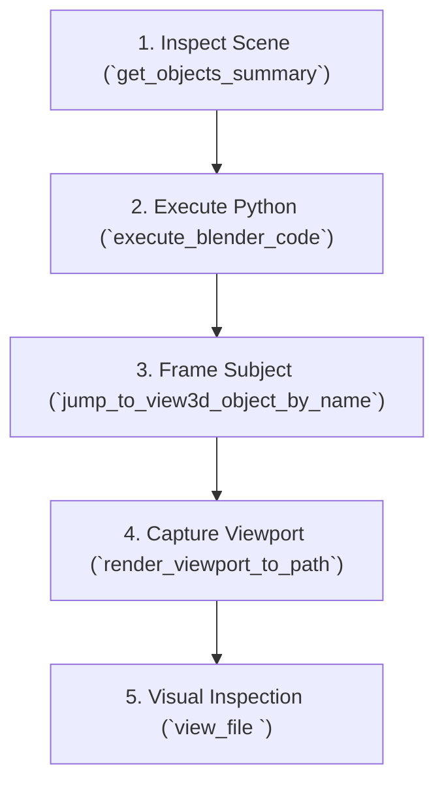

# Blender 3D & MCP Automation Workflows

This skill provides generic, battle-tested operational procedures, scripting guidelines, and integration workflows for **Blender 5.x+** using **Blender Python (`bpy`)** and the official **Blender Lab MCP Server**.

---

## 1. Architecture & Connectivity

The Blender MCP integration decouples the interactive editor from the LLM client through a two-tier bridge architecture:

```
┌──────────────────────┐    stdio JSON-RPC    ┌──────────────────────┐     TCP Socket     ┌────────────────────────┐
│  Antigravity / LLM   │ ◄──────────────────► │     blender-mcp      │ ◄──────────────► │     Blender 5.x        │
│      (Client)        │                      │  (MCP Server Python) │   localhost:9876 │  (mcp-1.0.x Add-on)    │
└──────────────────────┘                      └──────────────────────┘                    └────────────────────────┘
```

1. **Blender Add-on (`lab_blender_org.mcp`)**:
   - Installed inside Blender via Extensions / Add-ons (`mcp-1.0.3.zip`).
   - Runs a non-blocking TCP socket server on `localhost:9876` (`mcp_to_blender_server.py`).
   - Executes incoming Python requests directly within Blender's main thread loop via a non-blocking timer (`TIMER_INTERVAL_ACTIVE = 0.05s`).
2. **MCP Server Process (`blender-mcp`)**:
   - Runs in the background (configured in `~/.gemini/config/mcp_config.json`).
   - Communicates with Antigravity over standard I/O (JSON-RPC 2.0).
   - Translates tool requests into Python code payloads sent to Blender's TCP socket.

---

## 2. Key MCP Tools Reference

When interacting with a live Blender session via MCP tools:

### Scene Inspection & Navigation
- **`get_objects_summary`**:
  Returns the scene's collection hierarchy, visible/selected objects, object types, and active camera.
  *Use case*: Always inspect the scene first to orient yourself before adding or transforming objects.
- **`get_object_detail_summary(name: str)`**:
  Provides deep details for a specific object (mesh topology, vertex/face count, modifiers, materials, transform).
- **`jump_to_view3d_object_by_name(name: str)`**:
  Focuses and centers the 3D Viewport on the target object.
- **`get_blendfile_summary_datablocks`**:
  Summarizes all blend file datablocks (meshes, materials, textures, armatures, scenes).

### Script Execution (`execute_blender_code`)
- **`execute_blender_code(code: str)`**:
  Executes arbitrary Python code in Blender with captured stdout/stderr.
  > [!IMPORTANT]
  > **Return Value Rule**: The code executed in Blender **must** store its return value in a top-level dictionary named `result`.
  > ```python
  > import bpy
  > # Perform actions...
  > result = {
  >     "created": obj.name,
  >     "vertex_count": len(obj.data.vertices),
  > }
  > ```
  > Values inside `result` must be JSON-serializable primitives (dicts, lists, strings, numbers, booleans). Never place raw `bpy.types.Object` instances directly inside `result`.

### Visual Verification & Viewport Capture
- **`render_viewport_to_path(output_path: str)`**:
  Renders the active 3D Viewport directly to a PNG image file at native resolution with current viewport shading (Solid, Material Preview, or Rendered Cycles/Eevee).
- **`render_thumbnail_to_path(output_path: str)`**:
  Renders a lightweight thumbnail preview of the active camera view.
- **`get_screenshot_of_window_as_image` / `get_screenshot_of_area_as_image`**:
  Captures a screenshot of the entire Blender window or a specific workspace editor area as a base64 PNG.

---

## 3. Visual Verification Workflow

In graphics and 3D modeling, mathematical code alone is insufficient to guarantee quality (normals, UV unwrapping, topology flow, lighting, material shading).



1. **Execute Changes**: Add meshes, tweak curves, edit materials, or assign modifiers.
2. **Frame Camera / Viewport**: Use `jump_to_view3d_object_by_name` to ensure the object is in frame.
3. **Capture Viewport**: Call `render_viewport_to_path` targeting a temporary path (e.g. `/tmp/blender_preview.png`).
4. **Inspect Multimodally**: Use `view_file` to visually verify:
   - Geometry cleanliness and non-inverted normals.
   - Material shading, roughness, metallic response, and color correctness.
   - Absence of intersecting non-manifold geometry.

---

## 4. Blender Python (`bpy`) Best Practices

### A. Safe Mode Switching & Selection
Always ensure Blender is in `'OBJECT'` mode before modifying datablocks or running mesh operations that expect object context:
```python
import bpy

if bpy.context.object and bpy.context.object.mode != 'OBJECT':
    bpy.ops.object.mode_set(mode='OBJECT')

# Clear selection
bpy.ops.object.select_all(action='DESELECT')
```

### B. Mesh Creation & Clean Linking
Prefer creating objects cleanly and linking them into the active collection:
```python
import bpy

mesh = bpy.data.meshes.new(name="CustomMesh")
obj = bpy.data.objects.new(name="CustomObject", object_data=mesh)
bpy.context.collection.objects.link(obj)

# Set active and selected
bpy.context.view_layer.objects.active = obj
obj.select_set(True)
```

### C. Procedural Geometry with `bmesh`
For complex geometric manipulation, use the `bmesh` module rather than low-level raw arrays or operator macros:
```python
import bpy
import bmesh

bm = bmesh.new()
# Create geometry (e.g. cube, cylinder, custom faces)
bmesh.ops.create_cube(bm, size=2.0)

# Calculate normals cleanly
bm.normal_update()

# Write to mesh datablock
mesh = bpy.data.meshes.new(name="BmeshCube")
bm.to_mesh(mesh)
bm.free()

obj = bpy.data.objects.new("BmeshCubeObject", mesh)
bpy.context.collection.objects.link(obj)
```

---

## 5. Unreal Engine 5 Asset Export Pipeline

When preparing 3D assets in Blender for export to **Unreal Engine 5** (Static Meshes, Nanite geometry, collision hulls):

### Coordinates & Scale Alignment
- **Units**: Set scene units to Metric with Unit Scale `0.01` (so $1\text{ Blender Unit} = 1\text{ cm}$ in Unreal), OR keep Unit Scale `1.0` and apply a $\times 100$ scale factor during FBX export.
- **Axes**: Unreal Engine uses **Z-Up, X-Forward (Left-Handed)**. Blender uses **Z-Up, Y-Forward (Right-Handed)**. Standard export presets handle coordinate axis conversion automatically.

### Simplified Collision Meshes
To export custom Chaos collision geometry with your visual mesh:
- Prefix collision meshes with `UCX_<BaseMeshName>_##` (Convex Hull) or `UBX_<BaseMeshName>_##` (Box).
- Ensure collision meshes are manifold and convex.

### Standard Export Automation Script
```python
import bpy

# Select target object and its collision hulls
target_obj_name = "MyProp"
export_path = "/path/to/exported_prop.fbx"

bpy.ops.object.select_all(action='DESELECT')
target_obj = bpy.data.objects.get(target_obj_name)
if target_obj:
    target_obj.select_set(True)
    # Select associated UCX collision hulls
    for obj in bpy.data.objects:
        if obj.name.startswith(f"UCX_{target_obj_name}"):
            obj.select_set(True)

    bpy.ops.export_scene.fbx(
        filepath=export_path,
        use_selection=True,
        global_scale=1.0,
        apply_unit_scale=True,
        apply_scale_options='FBX_SCALE_ALL',
        axis_forward='-Z',
        axis_up='Y',
        bake_space_transform=False,
        mesh_smooth_type='FACE',
        use_mesh_modifiers=True,
    )
```

---

## 6. Connection & Troubleshooting Runbook

If communication fails or tools return connection errors:

1. **Verify Blender is Running**:
   ```bash
   ps aux | grep -i blender
   ```
2. **Check Port 9876**:
   ```bash
   ss -lptn 'sport = :9876'
   ```
   If nothing is listening, open Blender, go to **Edit → Preferences → Add-ons → Development: MCP**, and ensure **Start Server** is toggled ON.
3. **Verify MCP Configuration (`~/.gemini/config/mcp_config.json`)**:
   ```json
   {
     "mcpServers": {
       "blender": {
         "command": "/home/ezyrath/.local/share/blender-mcp-venv/bin/blender-mcp",
         "args": []
       }
     }
   }
   ```
4. **Test Quick Health Check**:
   Run the helper script:
   ```bash
   python3 ~/.gemini/config/plugins/antigravity-skills/skills/blender/scripts/test_blender_connection.py
   ```
